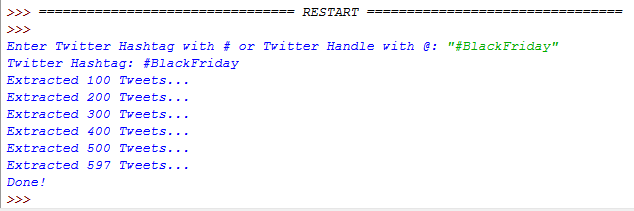
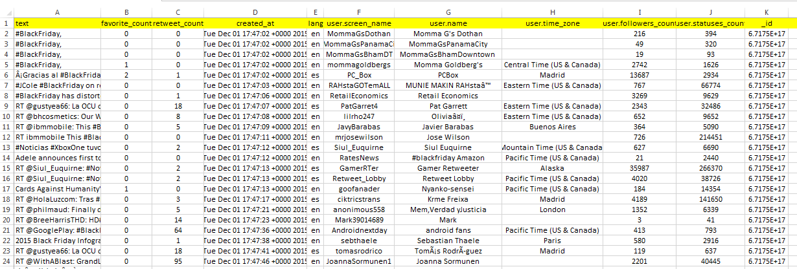

# Twitter-MongoDB-CSV-XLS
A simple tool to extract tweets, load them into a MongoDB instance and export them into CSV/XLS format

<h1>How To Use This Tool</h1>

1. Ensure you have the right version of Python installed (2.7 or higher)

2. Set up a local MongoDB instance and make sure it is up and running. 
   By default, MongoDB instance should accept connections via port 27017.
   
3. Create an account on http://dev.twitter.com and get your API keys
   You would need 4 parameters - consumer key, consumer secret, access token & access token secret
   
4. Run the Twitter + MongoDB + CSV.py script and input the desired Twitter Handle or Hashtag

5. Voila! Done! The script will extract a maximum of ~3000 tweets of the specified user or hashtag
   and load it into a new collection on the MongoDB instance. It will then export this data into a
   CSV file, using the mongoexport functionality.
   

<h1>How Does It Work</h2>

1. Get the desired twitter handle or hashtag to work with.
2. Call the Twitter API to extract a maximum of around ~3000 tweets for the specified user/hashtag
3. Load these 3000 tweets, returned in JSON format into MongoDB
4. Re-use the "id" field, returned by Twitter, as the primary key (PK) for the MongoDB collection
5. Invoke the mongoexport functionality, to export the collection to CSV/XLS format

